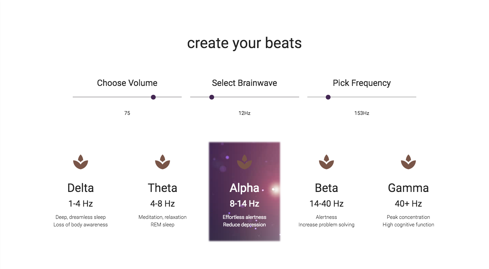
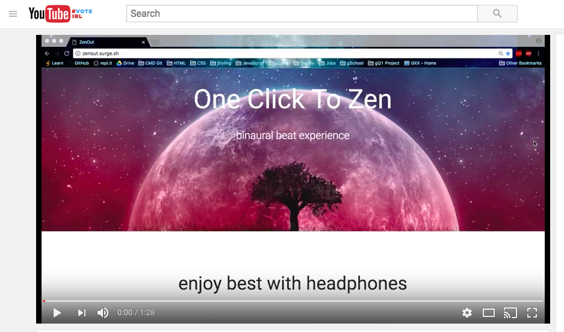

 
#Welcome to ZenOut!
[ZenOut](zenout.surge.sh) was created for you. When needing to change your current state of mind, turn to ZenOut's use of binaural 
beats to relax and soothe your brain or to turn your brain up to full functioning power! 

ZenOut uses the Web Audio API to pump two specially paired frequencies into each ear to create a third wave that is interpreted by the brain - the binaural beat. This binaural beat is correlated with a specific frame of mind - from deep REM sleep to ultimate problem solving mode!

ZenOut works best with headphones and you may find that raw binaural beats themselves may not sound that soothing. Great news! As long as ZenOut stays open, the beats you create will play in the background of your music & still work their magic. We've provided a few of our favorite sound samples on the website and a link to log into your Spotify.

##To Get Started

* Pop in your headphones.

* Scroll down to the beat maker. First, select your volume. Use the brainwave list below the sliders to find a brainwave frequency you'd like to experience. Move the Brainwave slider to pick that brainwave's Hz level. Find a base frequency that best suits you on the final slider.

* Pick your favorite nature sound or login into your Spotify to play music over the binaural beats.

* Now zenout!

After choosing your beats, enjoy an extra dose of goodness with a new inspiring quote each visit thanks to the Forismatic API.

Expand your knowledge on binaural beats and check out more great resources by visiting the Learn page.

For more instructions, check out the demo: 

Special thanks to all who made this project possible especially [Devin Hurd](https://github.com/HurdAudio) who shared his vast sound mixing knowledge, Brendan Haskins for his inspirational [polyphemus](http://ziopads-form.s3-website-us-east-1.amazonaws.com/), and Steve Kinney for [this](https://www.youtube.com/watch?v=56spBAgOYfg) video!

